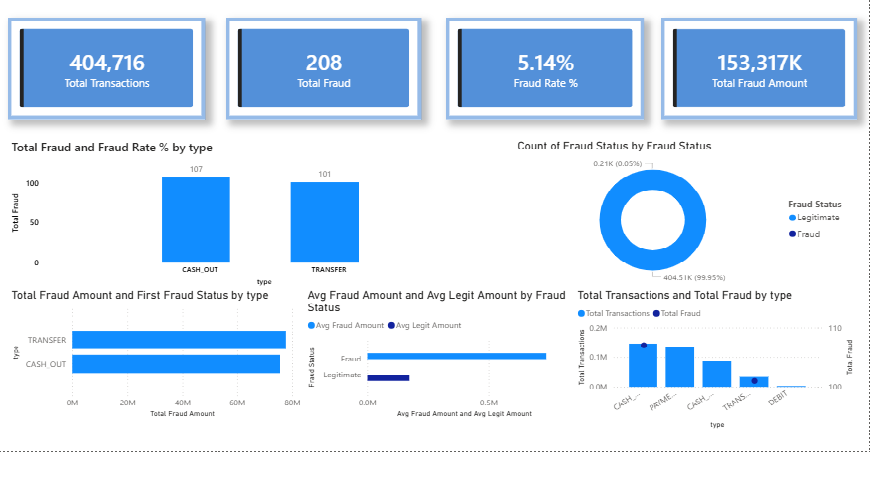
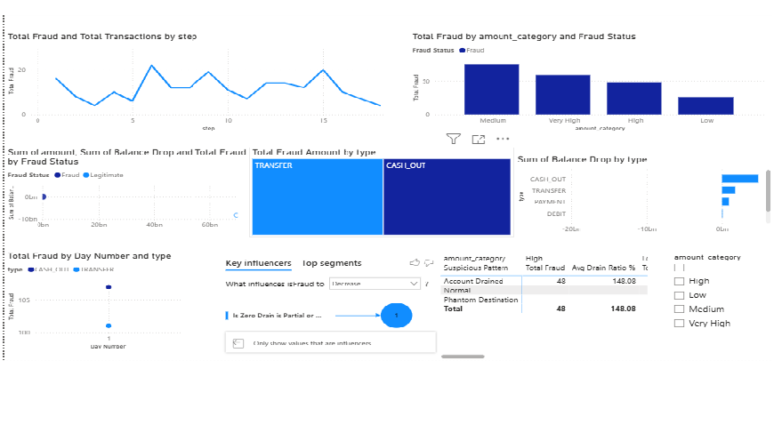
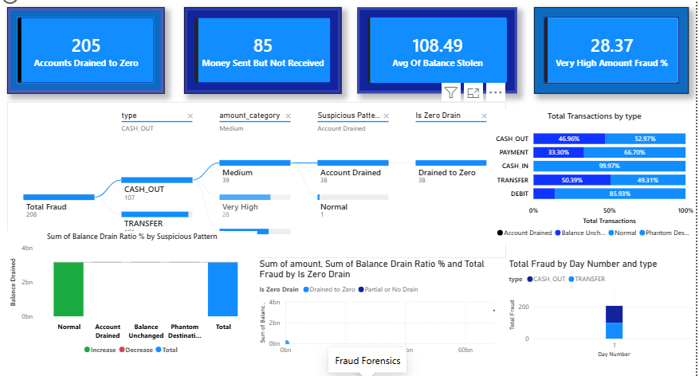

# fraud-Detection-analysis
Online payment fraud detection using MySQL and Power BI

# Online Payment Fraud Detection — Data Analytics Project

## Project Overview
This project analyzes 345,000+ financial transactions to detect patterns
in online payment fraud using MySQL for data analysis and Power BI for
interactive dashboards. The project addresses the growing FinTech fraud
crisis — over 10 lakh UPI fraud cases were reported in India in FY2025-26.

## Domain
FinTech / Financial Crime Analytics / Cybersecurity Analytics

## Tools Used
- MySQL Workbench — Data storage, cleaning, and analysis
- Power BI Desktop — Interactive dashboard and visualization
- DAX — Advanced calculated measures and columns

## Dataset
- Source: PaySim Synthetic Financial Dataset (Kaggle)
- Records: 407,711 transactions
- Columns: 11 (transaction type, amount, sender/receiver balances, fraud flag)

## Key Findings
1. Only 2 out of 5 transaction types contained fraud — TRANSFER and CASH-OUT
2. The existing fraud flagging system missed over 99% of real fraud cases
3. Fraudulent transactions drained victim accounts to zero in the majority of cases
4. The average fraud transaction was significantly larger than a normal transaction
5. Money sent in fraud cases often never arrived at the destination account

## Dashboard Pages
- Page 1: Executive Overview — KPI cards, fraud distribution, financial loss
- Page 2: Fraud Pattern Deep Dive — time trends, amount analysis, balance impact
- Page 3: Fraud Forensics — anomaly detection, Decomposition Tree, Key Influencers AI

## SQL Analysis
8 analytical queries covering:
- Fraud vs legitimate transaction split
- Fraud rate by transaction type
- Flagging system accuracy
- Balance drain patterns
- Amount bucket risk analysis

## How to View This Project
1. Open the .pbix file in Power BI Desktop (free download from microsoft.com)
2. The dashboard connects to the PaySim dataset

# Power BI Fraud Detection Dashboard
## Dashboard Preview




 


## SQL queries 
sql
CREATE DATABASE fraud_db;

USE fraud_db;


3D. Create the Table to Store Your Data

```sql
CREATE TABLE online_fraud (
    step INT,
    type VARCHAR(20),
    amount DECIMAL(20,2),
    nameOrig VARCHAR(50),
    oldbalanceOrg DECIMAL(20,2),
    newbalanceOrig DECIMAL(20,2),
    nameDest VARCHAR(50),
    oldbalanceDest DECIMAL(20,2),
    newbalanceDest DECIMAL(20,2),
    isFraud INT,
    isFlaggedFraud INT
);
```

```sql
SELECT COUNT(*) FROM online_fraud;
```

Check for NULL values

```sql
SELECT 
    SUM(CASE WHEN step IS NULL THEN 1 ELSE 0 END) AS null_step,
    SUM(CASE WHEN amount IS NULL THEN 1 ELSE 0 END) AS null_amount,
    SUM(CASE WHEN type IS NULL THEN 1 ELSE 0 END) AS null_type,
    SUM(CASE WHEN isFraud IS NULL THEN 1 ELSE 0 END) AS null_isfraud
FROM online_fraud;
```

-- Check distinct transaction types
```sql
SELECT DISTINCT type FROM online_fraud;
```

-- Check amount range
```sql
SELECT MIN(amount), MAX(amount), AVG(amount) FROM online_fraud;
```

-- Check fraud vs non-fraud split
```sql
SELECT isFraud, COUNT(*) as total 
FROM online_fraud 
GROUP BY isFraud;
```

STEP 4 — ANALYZE 

Analysis Query 1 — Total Fraud vs Legitimate Transactions
```sql
SELECT 
    isFraud,
    COUNT(*) AS total_transactions,
    ROUND(COUNT(*) * 100.0 / (SELECT COUNT(*) FROM online_fraud), 2) AS percentage
FROM online_fraud
GROUP BY isFraud;
```

Analysis Query 2 — Fraud by Transaction Type
```sql
SELECT 
    type,
    COUNT(*) AS total_transactions,
    SUM(isFraud) AS fraud_count,
    ROUND(SUM(isFraud) * 100.0 / COUNT(*), 3) AS fraud_rate_pct,
    ROUND(SUM(CASE WHEN isFraud = 1 THEN amount ELSE 0 END), 2) AS total_fraud_amount
FROM online_fraud
GROUP BY type
ORDER BY fraud_count DESC;
```

Analysis Query 3 — Average Amount: Fraud vs Normal
```sql
SELECT 
    isFraud,
    ROUND(AVG(amount), 2) AS avg_amount,
    ROUND(MIN(amount), 2) AS min_amount,
    ROUND(MAX(amount), 2) AS max_amount,
    ROUND(SUM(amount), 2) AS total_amount
FROM online_fraud
GROUP BY isFraud;
```

Analysis Query 4 — Flagging System Accuracy (Missed Frauds)
```sql
SELECT 
    isFraud,
    isFlaggedFraud,
    COUNT(*) AS count
FROM online_fraud
GROUP BY isFraud, isFlaggedFraud;
-- This shows you how many REAL frauds were NOT flagged (isFraud=1, isFlaggedFraud=0)
```

Analysis Query 5 — Fraud by Time Step (Hourly Trend)
```sql
SELECT 
    step,
    COUNT(*) AS total_transactions,
    SUM(isFraud) AS fraud_count
FROM online_fraud
GROUP BY step
ORDER BY step;
```

Analysis Query 6 — Balance Anomaly (Fraud Drains Accounts to Zero)
```sql
SELECT 
    type,
    ROUND(AVG(oldbalanceOrg), 2) AS avg_balance_before,
    ROUND(AVG(newbalanceOrig), 2) AS avg_balance_after,
    ROUND(AVG(oldbalanceOrg - newbalanceOrig), 2) AS avg_balance_drop
FROM online_fraud
WHERE isFraud = 1
GROUP BY type;
```

Analysis Query 7 — Top 10 Largest Fraud Transactions
```sql
SELECT 
    nameOrig, 
    nameDest, 
    type, 
    amount, 
    oldbalanceOrg, 
    newbalanceOrig,
    step
FROM online_fraud
WHERE isFraud = 1
ORDER BY amount DESC
LIMIT 10;
```

Analysis Query 8 — Amount Bucket Analysis (Is High Amount = More Fraud?)
```sql
SELECT 
    CASE 
        WHEN amount < 10000 THEN 'Low (<10K)'
        WHEN amount BETWEEN 10000 AND 100000 THEN 'Medium (10K-100K)'
        WHEN amount BETWEEN 100000 AND 500000 THEN 'High (100K-500K)'
        ELSE 'Very High (>500K)'
    END AS amount_bucket,
    COUNT(*) AS total,
    SUM(isFraud) AS frauds,
    ROUND(SUM(isFraud)*100.0/COUNT(*), 2) AS fraud_pct
FROM online_fraud
GROUP BY amount_bucket
ORDER BY fraud_pct DESC;
```


## Contact
Nivedya Shaji| nivedyapayyathil123@gmil.com | LinkedIn: https://www.linkedin.com/in/nivedya-shaji/
